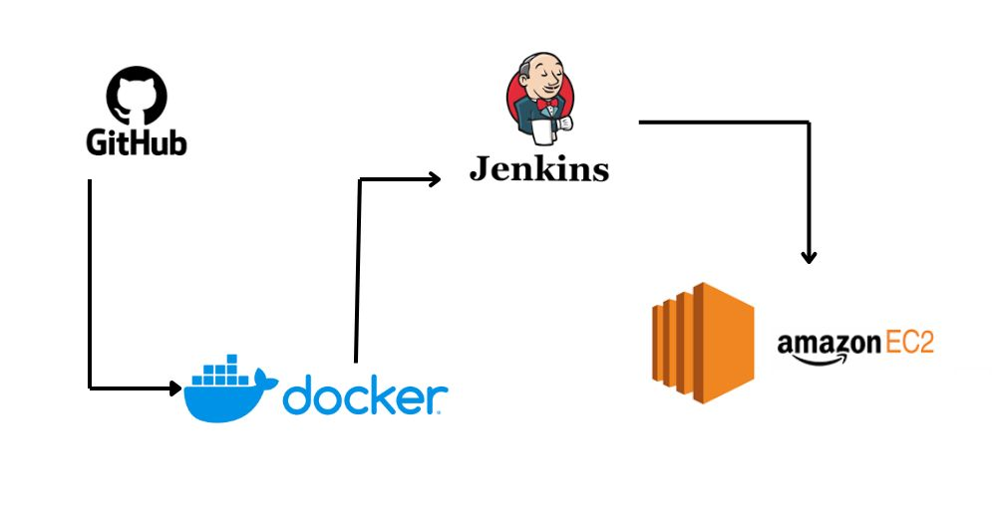
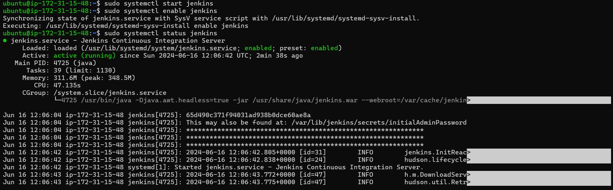
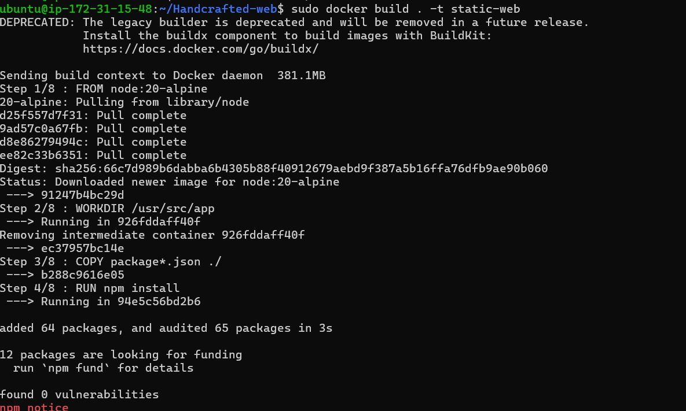
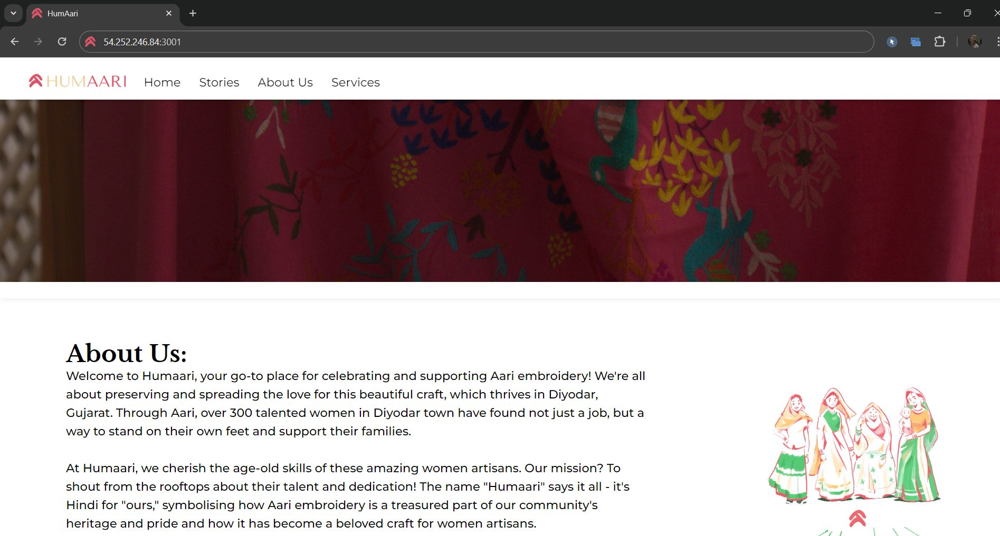

# Seamless Deployment Pipeline with Jenkins and Amazon EC2

This project demonstrates a robust CI/CD pipeline using Jenkins, Docker, and Amazon EC2, integrated with GitHub for seamless version control and collaboration. The setup significantly enhances the development workflow, enabling faster and more reliable releases.

## Table of Contents

- [Introduction](#introduction)
- [Architecture](#architecture)
- [Prerequisites](#prerequisites)
- [Setup and Installation](#setup-and-installation)
- [Pipeline Workflow](#pipeline-workflow)
- [Technologies Used](#technologies-used)
- [Contributing](#contributing)
- [License](#license)
- [Contact](#contact)

## Introduction

The goal of this project is to automate the build, test, and deployment processes using a CI/CD pipeline. The setup includes:

- **GitHub** for version control and collaboration.
- **Jenkins** for continuous integration and deployment.
- **Docker** for containerization, ensuring consistent development and production environments.
- **Amazon EC2** for scalable and reliable deployment.

This infrastructure enables developers to deliver features more frequently and confidently by automating the integration and deployment process.

## Architecture



The pipeline follows these steps:

1. **Code Commit**: Developers commit code to a GitHub repository.
2. **Continuous Integration**: Jenkins automatically triggers a build when changes are detected in the repository.
3. **Containerization**: The application is containerized using Docker, ensuring a consistent runtime environment.
4. **Continuous Deployment**: The Docker image is deployed to an Amazon EC2 instance, scaling as needed.

## Prerequisites

Before setting up this project, ensure you have the following:

- A GitHub account with a repository for your project.
- Jenkins installed and configured.
- Docker installed and running on the Jenkins server.
- An AWS account with permissions to create and manage EC2 instances.
- Basic knowledge of Git, Jenkins, Docker, and AWS.

## Setup and Installation

Follow these steps to set up the CI/CD pipeline:

1. **Clone the GitHub Repository**:
    ```bash
    git clone https://github.com/your-username/your-repo.git
    ```

2. **Install Jenkins**: Follow the [official Jenkins installation guide](https://www.jenkins.io/doc/book/installing/) for your operating system.

3. **Configure Jenkins**:
   - Install necessary plugins: Git, Docker, Amazon EC2.
   - Set up GitHub integration for webhooks to trigger builds.

4. **Install Docker**:
    ```bash
    sudo apt-get update
    sudo apt-get install docker-ce docker-ce-cli containerd.io
    ```

5. **Set Up EC2 Instance**:
   - Launch an EC2 instance using the AWS Management Console.
   - Configure security groups to allow SSH and HTTP access.

6. **Create Jenkins Pipeline**:
   - Go to Jenkins Dashboard > New Item > Pipeline.
   - Configure the pipeline script to pull from the GitHub repository and use Docker for builds.

7. **Deploy Docker Image to EC2**:
   - Use SSH to connect to the EC2 instance and run the Docker container.

## Pipeline Workflow

1. **Git Commit**: Developer pushes code to the GitHub repository.
2. **Jenkins Build**: Jenkins pulls the latest code and triggers a build.
   
3. **Docker Build**: Jenkins uses Docker to create a new image.
   
4. **Deploy to EC2**: The new Docker image is pushed to the EC2 instance.
   

## Technologies Used

- **GitHub**: Version control and collaboration.
- **Jenkins**: Continuous integration and deployment.
- **Docker**: Containerization for consistent environments.
- **Amazon EC2**: Scalable and reliable deployment platform.

## Contributing

Contributions are welcome! Please fork the repository and submit a pull request.

1. Fork the Project.
2. Create your feature branch: `git checkout -b feature/YourFeature`
3. Commit your changes: `git commit -m 'Add some feature'`
4. Push to the branch: `git push origin feature/YourFeature`
5. Open a pull request.

## License

Distributed under the MIT License. See `LICENSE` for more information.

## Contact

Your Name - [Yash Singh](mailto:yashsingh.2803@gmail.com)

Project Link: [https://github.com/yash28000/Handcrafted-web](https://github.com/yash28000/Handcrafted-web)
